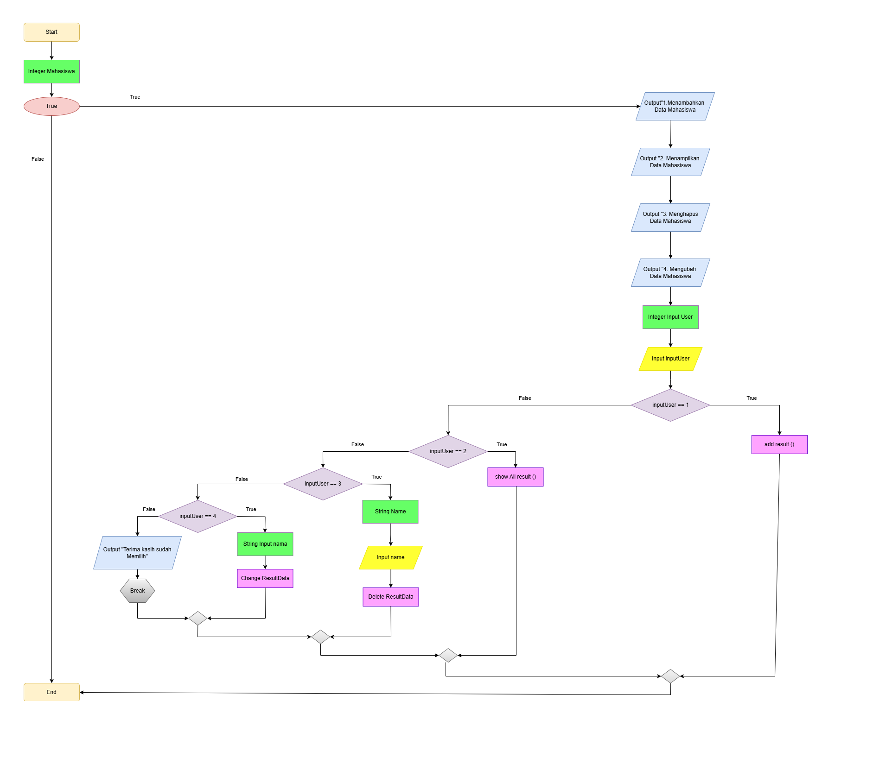

# Input dan Output dari Praktikum 6
## Input
```Python
def tambah(data_mahasiswa):
  nama = input("Masukkan nama mahasiswa: ")
  nilai = float(input("Masukkan nilai mahasiswa: "))
  data_mahasiswa.append({"nama": nama, "nilai": nilai})
  print("Data mahasiswa berhasil ditambahkan.")

def tampilkan(data_mahasiswa):
  if not data_mahasiswa:
    print("Data mahasiswa masih kosong.")
  else:
    print("Daftar Nilai Mahasiswa:")
    print("--------------------------")
    for mahasiswa in data_mahasiswa:
      print(f"Nama: {mahasiswa['nama']} , Nilai: {mahasiswa['nilai']}")
      print("--------------------------")

def hapus(data_mahasiswa, nama):
  for i, mahasiswa in enumerate(data_mahasiswa):
    if mahasiswa['nama'] == nama:
      del data_mahasiswa[i]
      print(f"Data mahasiswa dengan nama {nama} berhasil dihapus.")
      return
  print(f"Data mahasiswa dengan nama {nama} tidak ditemukan.")

def ubah(data_mahasiswa, nama):
  for mahasiswa in data_mahasiswa:
    if mahasiswa['nama'] == nama:
      nilai_baru = float(input("Masukkan nilai baru: "))
      mahasiswa['nilai'] = nilai_baru
      print(f"Data mahasiswa dengan nama {nama} berhasil diubah.")
      return
  print(f"Data mahasiswa dengan nama {nama} tidak ditemukan.")

# Inisialisasi data mahasiswa
data_mahasiswa = []

# Menu program
while True:
  print("\nMenu:")
  print("1. Tambah data mahasiswa")
  print("2. Tampilkan data mahasiswa")
  print("3. Hapus data mahasiswa")
  print("4. Ubah data mahasiswa")
  print("5. Keluar")
  pilihan = input("Pilih menu (1/2/3/4/5): ")

  if pilihan == '1':
    tambah(data_mahasiswa)
  elif pilihan == '2':
    tampilkan(data_mahasiswa)
  elif pilihan == '3':
    nama = input("Masukkan nama mahasiswa yang ingin dihapus: ")
    hapus(data_mahasiswa, nama)
  elif pilihan == '4':
    nama = input("Masukkan nama mahasiswa yang ingin diubah: ")
    ubah(data_mahasiswa, nama)
  elif pilihan == '5':
    break
  else:
    print("Pilihan tidak valid.")
```
## Output
```Python
Menu:
1. Tambah data mahasiswa
2. Tampilkan data mahasiswa
3. Hapus data mahasiswa
4. Ubah data mahasiswa
5. Keluar
Pilih menu (1/2/3/4/5): 1
Masukkan nama mahasiswa: Ibnu
Masukkan nilai mahasiswa: 99
Data mahasiswa berhasil ditambahkan.

Menu:
1. Tambah data mahasiswa
2. Tampilkan data mahasiswa
3. Hapus data mahasiswa
4. Ubah data mahasiswa
5. Keluar
Pilih menu (1/2/3/4/5): 1
Masukkan nama mahasiswa: Nazhif
Masukkan nilai mahasiswa: 97
Data mahasiswa berhasil ditambahkan.

Menu:
1. Tambah data mahasiswa
2. Tampilkan data mahasiswa
3. Hapus data mahasiswa
4. Ubah data mahasiswa
5. Keluar
Pilih menu (1/2/3/4/5): 1
Masukkan nama mahasiswa: Alam
Masukkan nilai mahasiswa: 89
Data mahasiswa berhasil ditambahkan.

Menu:
1. Tambah data mahasiswa
2. Tampilkan data mahasiswa
3. Hapus data mahasiswa
4. Ubah data mahasiswa
5. Keluar
Pilih menu (1/2/3/4/5): 2
Daftar Nilai Mahasiswa:
--------------------------
Nama: Ibnu , Nilai: 99.0
--------------------------
Nama: nazhif , Nilai: 97.0
--------------------------
Nama: alam , Nilai: 89.0
--------------------------

Menu:
1. Tambah data mahasiswa
2. Tampilkan data mahasiswa
3. Hapus data mahasiswa
4. Ubah data mahasiswa
5. Keluar
Pilih menu (1/2/3/4/5): 5
```
## Flowcart


## Penjelasan 
- Fungsi ini digunakan untuk menambahkan data mahasiswa ke dalam daftar data_mahasiswa.
Di dalam fungsi ini, program meminta pengguna untuk memasukkan nama mahasiswa dan nilai mereka menggunakan input().
Nilai yang dimasukkan oleh pengguna diubah menjadi tipe data float untuk memastikan nilai berupa angka desimal.
Data mahasiswa kemudian ditambahkan ke dalam list data_mahasiswa dalam bentuk dictionary dengan key 'nama' dan 'nilai'.
Setelah data berhasil ditambahkan, akan ada pesan konfirmasi yang muncul.
Fungsi tampilkan(data_mahasiswa)
- Fungsi ini digunakan untuk menampilkan daftar mahasiswa yang ada dalam list data_mahasiswa.
Program memeriksa apakah list data_mahasiswa kosong atau tidak. Jika kosong, akan muncul pesan "Data mahasiswa masih kosong."
Jika ada data, maka program akan menampilkan setiap nama mahasiswa dan nilai mereka dalam format yang rapi.
Fungsi hapus(data_mahasiswa, nama)
- Fungsi ini digunakan untuk menghapus data mahasiswa berdasarkan nama yang dimasukkan oleh pengguna.
Program akan mencari mahasiswa berdasarkan nama di dalam list data_mahasiswa. Jika ditemukan, data mahasiswa tersebut akan dihapus menggunakan del.
Jika mahasiswa dengan nama yang dimaksud ditemukan, maka akan muncul pesan konfirmasi penghapusan.
Jika tidak ditemukan, akan muncul pesan bahwa mahasiswa dengan nama tersebut tidak ada dalam daftar.
- Fungsi ubah(data_mahasiswa, nama)
- Fungsi ini digunakan untuk mengubah nilai mahasiswa berdasarkan nama yang dimasukkan oleh pengguna.
Program akan mencari mahasiswa dengan nama yang sesuai dalam list data_mahasiswa.
List kosong data_mahasiswa diinisialisasi untuk menyimpan data mahasiswa.
Menu Program
Program akan menampilkan menu dengan pilihan:
Menambah data mahasiswa (1)
Menampilkan data mahasiswa (2)
Menghapus data mahasiswa berdasarkan nama (3)
Mengubah nilai mahasiswa berdasarkan nama (4)
Keluar dari program (5)
Program akan terus berjalan di dalam loop while True, menunggu input pilihan dari pengguna.
Berdasarkan input pengguna (pilihan), program akan mengeksekusi fungsi yang sesuai (misalnya, tambah, tampilkan, hapus, atau ubah).
Jika pengguna memilih pilihan yang tidak valid, maka program akan menampilkan pesan "Pilihan tidak valid."
## Cara Kerja Program
1.tambah data mahasiswa: Pengguna dapat menambahkan nama dan nilai mahasiswa ke dalam list.

2.Tampilkan data mahasiswa: Menampilkan semua data mahasiswa yang sudah dimasukkan.

3.Hapus data mahasiswa: Menghapus data mahasiswa berdasarkan nama yang dimasukkan.

4.Ubah data mahasiswa: Mengubah nilai mahasiswa berdasarkan nama yang dimasukkan.

5.Keluar: Program berhenti dengan memilih pilihan 5.
